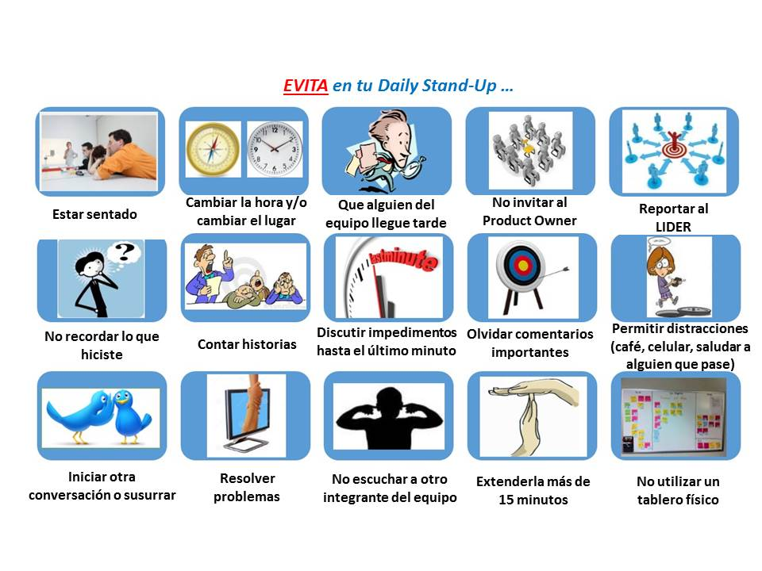

# ¿Cómo Potenciamos las Daily Meetings?

## Siempre da una señal para finalizar la reunión

 Ed Gibbs comenta en su post:

> Déjame contarles una historia divertida cuando regresé de mis vacaciones. En mi posición de líder técnico era el encargado de facilitar las daily meetings.
>
> Durante una de estas reuniones se terminó con todos los informes en menos de quince minutos, en ese momento solo hubo silencio en la habitación durante unos dos minutos seguidos, resulta que todos estaban esperando mi aparente frase de "bien, disfrute de su almuerzo a todos". Finalmente alguien tuvo el valor de preguntar si la reunión había terminado, y todos se rieron al darse cuenta de que la reunión había terminado dos minutos antes. Para que pueda establecer un ritmo en el proyecto con los elementos más pequeños, incluso una línea desechable para indicar el final de standup

Como conclusión de esta historia, hay que establecer un ritmo en el proyecto inclusive en las pequeñas cosas como una palabra o una oración para indicar el fin de la reunión

En nuestro caso, el fin de la reunión se dá con nuestro grito de guerra "Go Amida"

Extraído de: [http://edgibbs.com/2006/08/07/signaling-the-end-of-a-standup/](http://edgibbs.com/2006/08/07/signaling-the-end-of-a-standup/)

## Otros recursos de Interés

[https://martinfowler.com/articles/itsNotJustStandingUp.html](https://martinfowler.com/articles/itsNotJustStandingUp.html)

##  

