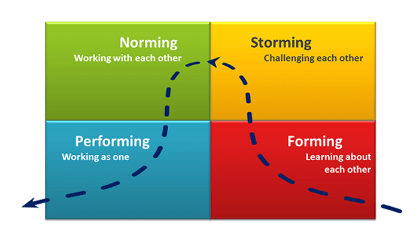

# Fomando equipos ágiles

## La Historia

[¿Cómo funciona una manada de lobos?](https://www.youtube.com/watch?v=dP22Z8063mo)

## Modelo de desarrollo de equipos de Tuckman

Tuckman plantea un esquema evolutivo basado en 5 etapas que son aplicadas a los equipos

1. Forming \(Formación\)
2. Storming \(Conflicto\)
3. Norming \(Normalización\)
4. Performing \(Desempeño\)

#### 5. Adjourning \(Terminación\)

Esta última etapa, incluida en 1977, doce años después del modelo original ve al grupo desde una perspectiva global e integradora, mas allá del propósito de las cuatro primeras fases.

Comienza la disolución del equipo, se presenta el sentimiento de pérdida e incertidumbre por el futuro que supone la partida de los integrantes del equipo a realizar nuevas tareas o proyectos, particularmente si los miembros del grupo han estado muy unidos y sienten  inseguridad o amenaza ante este cambio.  

Se hace necesario la gestión de esta etapa, ejecutar planes de ejecución y comunicación para mitigar los riesgos

Al parecer tiene mucho que ver con el [Delegation Pocker](https://management30.com/practice/delegation-poker/) que se presenta en el management 3.0

### Dinámica para explicar el modelo



## Shu Ha Ri

## Team Competency Matrix

Del Management 3.0 de Jurgen Apelo se extrae esta herramienta llamada [Matriz de competencia del equipo](https://management30.com/practice/competency-matrix/), 







## Recursos

* [Comenzando un equipo scrum](http://www.lecciones-aprendidas.info/2015/08/comenzando-con-un-equipo-en-scrum-parte.html)
* [Crónica de Agni](http://www.javiergarzas.com/2018/09/las-cronicas-de-agni-4-agni-ira-a-la-pam-2018.html)





