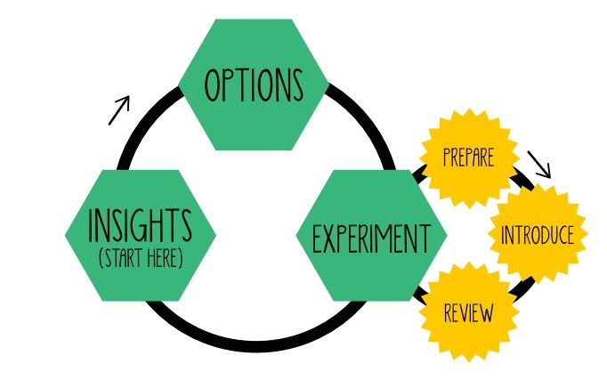

# Lean Change Management

## Contexto

He estado asignado a un equipo por mas de 9 meses en donde hemos madurado nuestra agilidad hasta llegar a un nivel en donde todos estamos satisfechos a pesar de que sabemos que tenemos algunas oportunidades de mejora.

Dado esto, como parte de la colaboración con otros equipos, se ha levantado en la sesión de replenishment \(de el otro squad "Keepers" al que pertenezco cuyo dominino es asegurar la agilidad en lo equipos\) la necesidad de potenciar y madurar el mindset ágil de otros equipos, el problema es que keepers no dispone de las personas suficientes para que se asigne un facilitador a cada equipo. Por lo que la decisión que tomamos, fue intervenir en los otros equipos por una semana, para hacer un diagnostico y comenzar actividades que mejoren el mindset del equipo.

All experiments start with hypothesis. Below you find a [hypothesis structure](https://luis-goncalves.com/how-to-use-retrospective-in-scrum-to-learn/):

_We hypothesise by &lt;implementing this change&gt;_

_We will &lt;solve this problem&gt;_


_Which will have &lt;these benefits&gt;_


_As measured by &lt;this measurement&gt;_  

## Recursos









