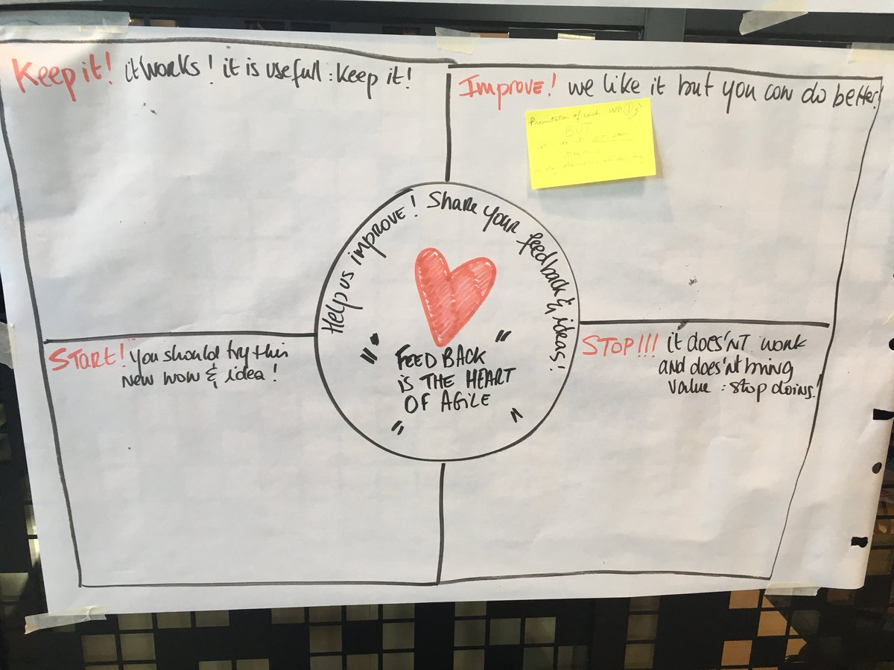
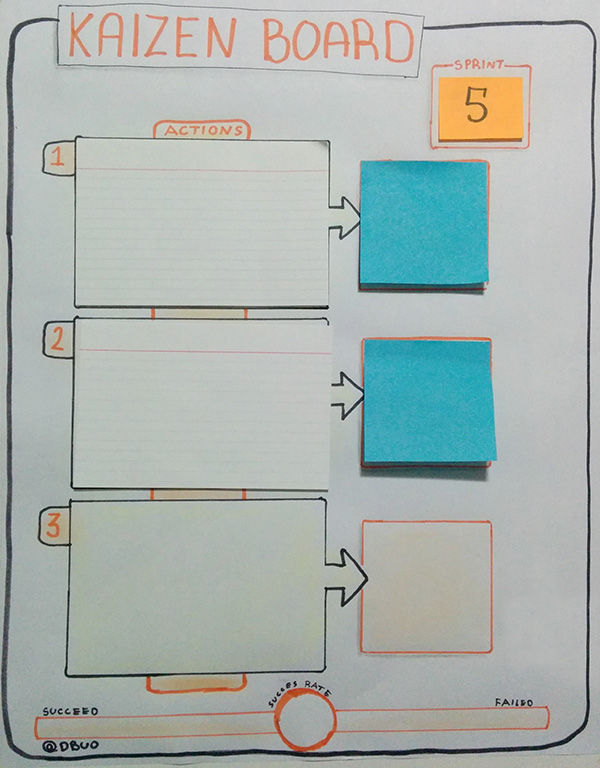
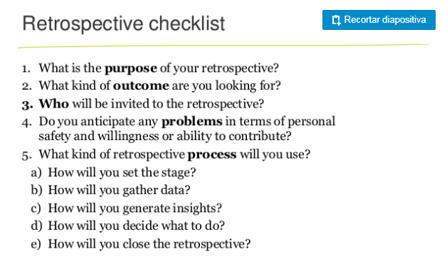

# ¿Qué revisamos en las retrospectivas?

## Contexto

> "At regular intervals, the team reflects on how to become more effective, then tunes and adjusts its behaviour accordingly.”  
> — one of the [principles of the Agile Manifesto](http://agilemanifesto.org/principles.html)

## ¿Cómo desarrollar la retrospectiva?

Una de la primeras cosas que aprendí al facilitar retrospectivas es establecer un ambiente seguro dentro del equipo y dentro la sala, para esto hablo con todos y establezco lo siguiente:

1. Lo que pase en la retro se queda dentro del equipo como enseñanza, para aprender y mejorar.
2. Todo lo que se diga debe basarse en el respecto y la empatía con la otra persona.
3. Por último pero no menos importante, la lectura de la "Prime Directive" de las retrospectiva, que expone:

> Regardless of what we discover, we understand and truly believe that everyone did the best job he or she could, given what was known at the time, his or her skills and abilities, the resources available, and the situation at hand.
>
>  --Norm Kerth, Project Retrospectives: A Handbook for Team Review

> Independientemente de lo que descubramos, debemos entender y creer de verdad que todo el mundo hace el mejor trabajo que él o ella podría, dado lo que se sabía en ese momento, sus habilidades y capacidades, los recursos disponibles y la situación actual.

Más allá del típico modelo de ¿Qué hicimos bien?, ¿Qué hicimos mal?, blah, blah encontré esta forma de obtener la información, la saqué de un twitt de Rachel Dobouis.

### Usar el kaizen board para hacer seguimiento de la retro

###  Checklist para las retrospectivas

## Dinámicas para una retrospectivas \(ice-breakers\)

### Para una retro rápida





### Para team building

* [The candy Love](http://www.funretrospectives.com/candy-love/)

### Para Colaboración

* [Back 2 Back](http://www.funretrospectives.com/back-to-back/)

### Para Salud del equipo

* [Spotify Squad Health Check](https://labs.spotify.com/2014/09/16/squad-health-check-model/)

## Recursos

* [GOTO 2016 • Retrospective Anti-Patterns • Aino Vonge Corry](https://www.youtube.com/watch?v=Os7_lF6VMXw)
* [\ Buonamico[\], 2018, Patologías de las Retros y Kaizen Board](http://c0920343.ferozo.com/2015/07/19/kaizen-board-y-patologias-de-retrospectivas/)
* [\[Bunamico\], 2018, Retrospectivas no solo accionables](http://www.caminoagil.com/2016/07/29/retrospectivas-agiles-no-solo-accionables/)
* [\[Rachel Jolin Dubois, 2018\] twitter](https://twitter.com/duboisrachel)
* [SlideShare](https://es.slideshare.net/jchyip/a-guide-forpreparingandfacilitatingretrospectives)
* [Funny Retros](http://www.funretrospectives.com/category/team-building/)



